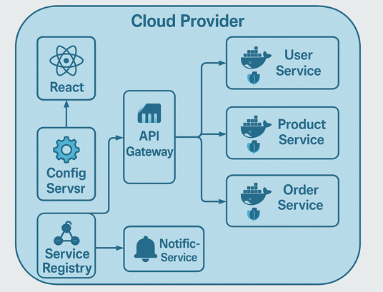

🛍️ E-Commerce Microservices System
This project is a microservices-based e-commerce application built with Spring Boot, implementing key architectural patterns like API Gateway, Service Discovery (Eureka), and Centralized Configuration (Config Server). Each microservice is designed to be independently deployable and scalable.

🧱 Tech Stack
Java 17+

Spring Boot

Spring Cloud (Eureka, Config Server, Gateway)

MongoDB 

Maven

Docker (optional)

Lombok

Swagger/OpenAPI

📦 Microservices Overview
Service	Description
Service Registry	Eureka Server to register and discover services.
Config Server	Centralized external configuration management for all services.
API Gateway	Single entry point for all client requests. Handles routing, filtering, and security.
Product Service	Handles product management (CRUD).
Order Service	Manages order placement and status tracking.
User Service	Manages user registration, authentication, and profiles.
Inventory Service	Tracks product inventory and availability.
🔁 Communication
All services register with Eureka Server.

Services fetch configurations from Config Server.

External clients interact only through the API Gateway.

Internal service-to-service communication via REST.

🚀 Getting Started
To run the full system:

Start Eureka Server http://localhost:8761/
cd serviceregistry-service && mvn spring-boot:run  

Start Config Server  http://localhost:8889/actuator/health
cd configserver-service && mvn spring-boot:run

Start API Gateway    http://localhost:9191/
cd apigateway-service && mvn spring-boot:run

Start Other Services
Run mvn spring-boot:run in each service folder.

Ensure your application.properties / application.yml files are configured properly to use Eureka and Config Server.

🔒 Security & Authorization
 integrate Spring Security + OAuth2 at the API Gateway level to secure endpoints.

 Start MongoDB
net start MongoDB
Structure of the Project

 